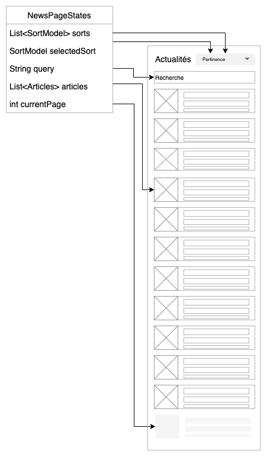
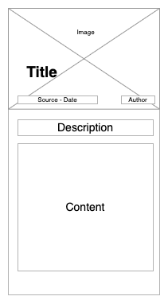
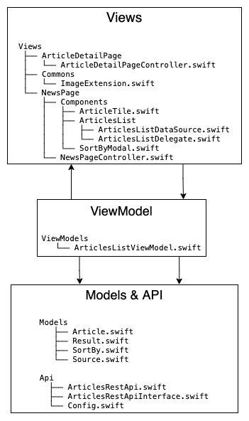
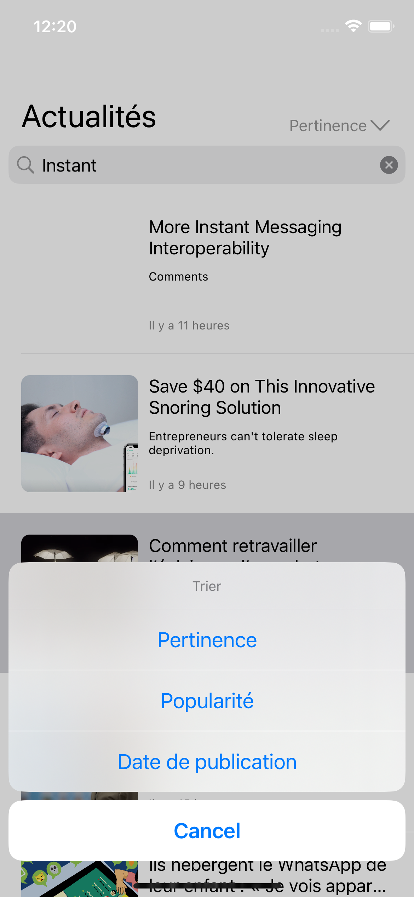
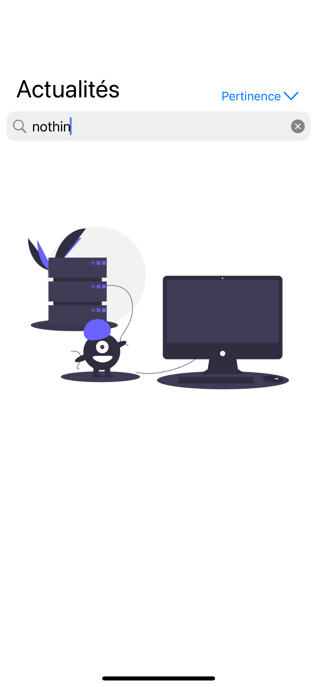

# Wireframe

## News page

News page is the home page of the page and will allow user to

- Search a specific terme in the news
- Sort the results if there are some by
    - relevancy
    - popularity
    - publishedAt
- Have a list of some news
    - If no query term was taped, the app load the top-headlines of the API
    - If the user scroll and reach the end of the table, the app launch an autoscroll mechanism to load more data

When user click on a specific article the app open the article details

## Article details page

# Project architecture & structure

# Screenshots

### Hot headline when the app opened and idle

### Search for a specific term

### Use the sort by modal

### Search for a specific term and empty result

### Open article details

### Share the opened article

